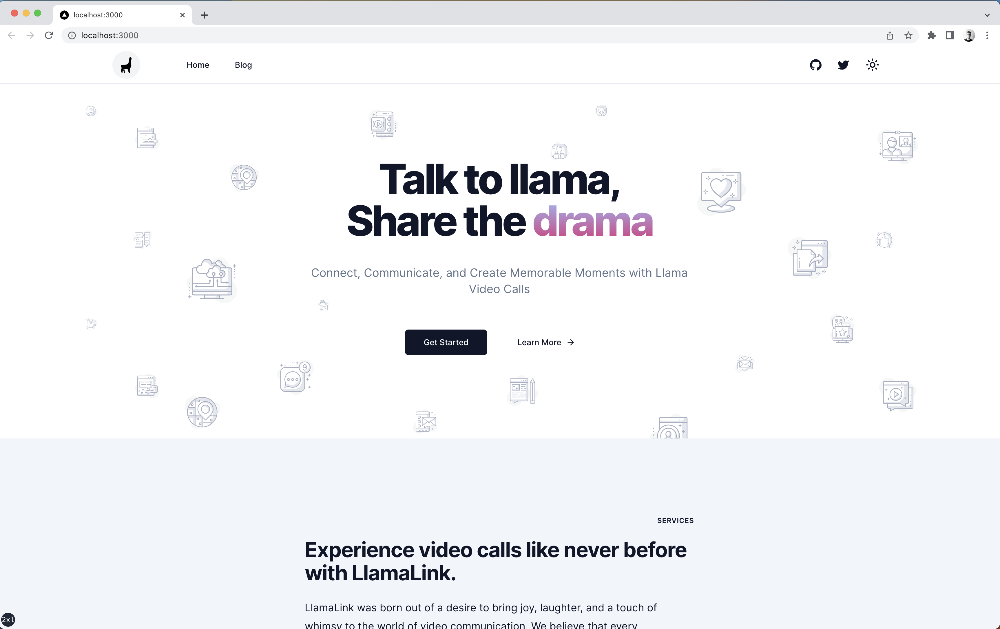

# Running the static website

This repo comes with a fully-functional website template, complete with a home page, a blog list page, and a blog page. It's based off of the excellent [shadcn.ui starter](https://github.com/shadcn/ui)
To get started, all of the content has been hardcoded, run the `dev` script to see things in action:

```
npm install
```

```
npm run dev
```

You should see the homepage:



## Familiarizing yourself with the website

This website is built on NextJS using the `/app` directory. You can find more details about how NextJS works by visiting their [documentation](https://nextjs.org/docs/app)

### The `app/page` route

This is the home page, and it renders a few components: `SiteHeader`, `WelcomeHero`, `FeatureList`, `FeaturedReading`, and `Footer`. These are the basic
building blocks for generic pages you may want throughout the site.

### The `app/blog` route

Here we have a hardcoded list of blog posts. We'll be replacing these with real data from TinaCMS

### The `app/blog/[slug]` route

This is the blog page for each post, you'll notice that the data is hardcoded here as well. When we add tina we'll use the dynamic `[slug]` parameter
to fetch the appropriate post (eg. `/blog/hello-world`)

### The `components` directory

This is where we're storing all of the components for the site, a lot of what we'll be doing in this tutorial is replacing their
content with data from Tina.
