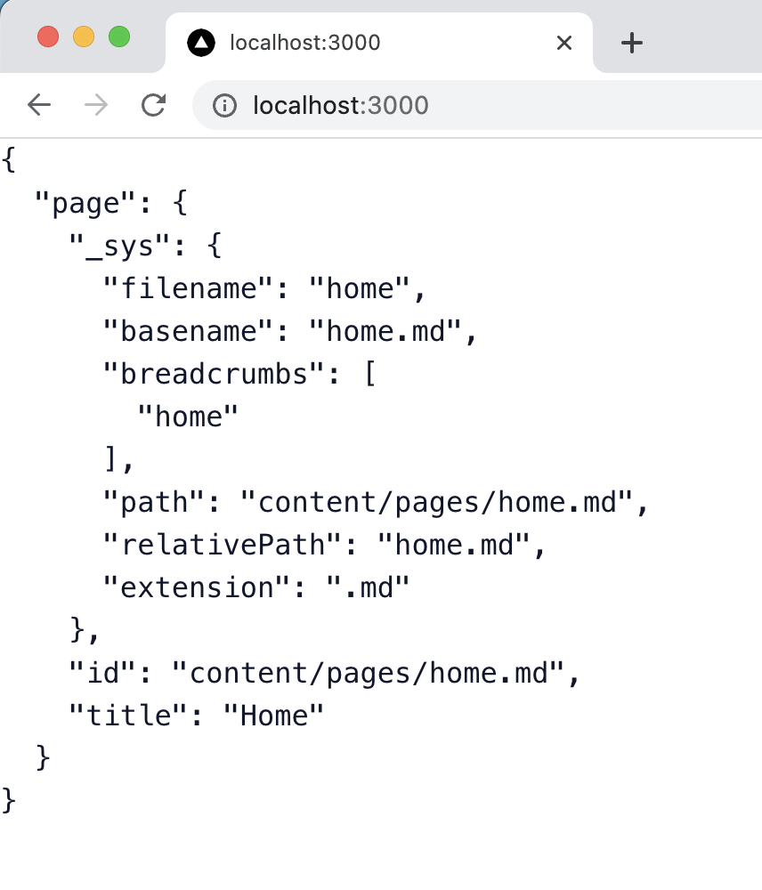

# Data fetching

Tina's headless GraphQL API allows you to query for markdown files in your repo at runtime. To do this, we'll import
the autogenerated `client` module at `tina/__generated__/client.ts`. This client provides some queries out of the box that are
specific to your schema, you can learn more about the autogenerated client [here](https://tina.io/docs/features/data-fetching/#the-local-filesystem-based-content-api).

To fetch data from a component in NextJS 13, we need to turn it into an async function. In `app/page.tsx`, we can ignore the current:
code and just make sure things work:

```ts
import { client } from "@/tina/__generated__/client"

export default async function Page() {
  const result = await client.queries.page({ relativePath: "home.md" })

  return <pre>{JSON.stringify(result.data, null, 2)}</pre>
}
// import { FeaturedReading } from "@/components/blog-list"
// import { FeatureList } from "@/components/features"
// import { Footer } from "@/components/footer"
// import { SiteHeader } from "@/components/site-header"
// import { WelcomeHero } from "@/components/welcome-hero"

// export default function Page() {
//   return (
//     <>
//       <SiteHeader />
//       <WelcomeHero />
//       <FeatureList />
//       <FeaturedReading />
//       <Footer />
//     </>
//   )
// }
```

You should see the data for the `home.md` page on your screen at `http://locahost:3000`:


